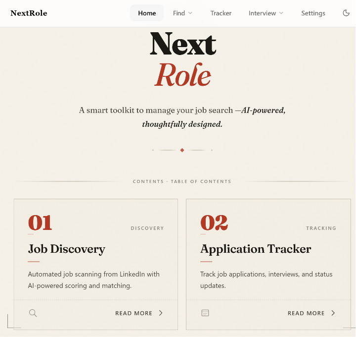
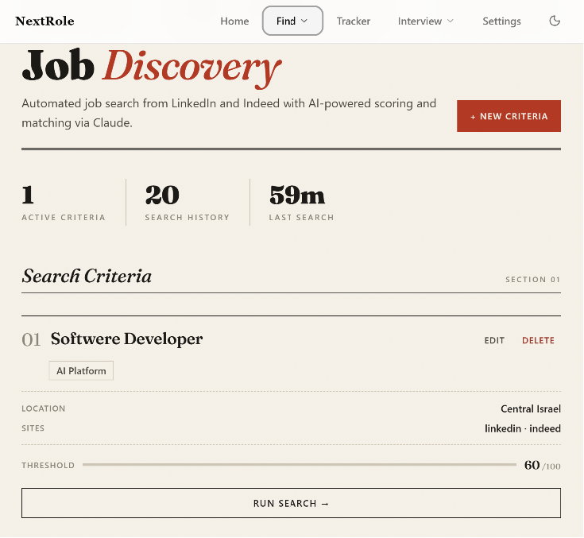
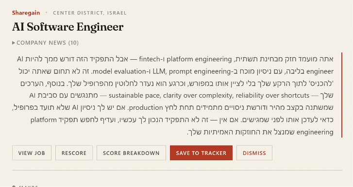
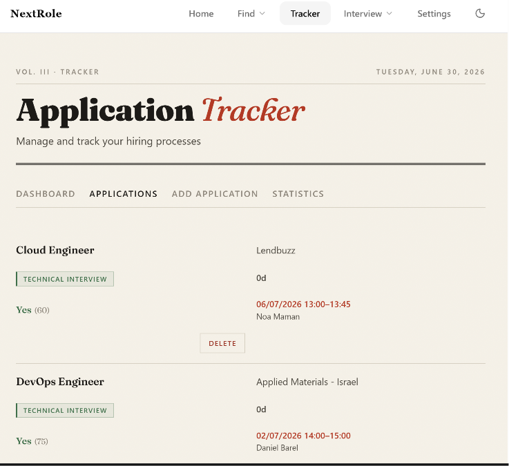
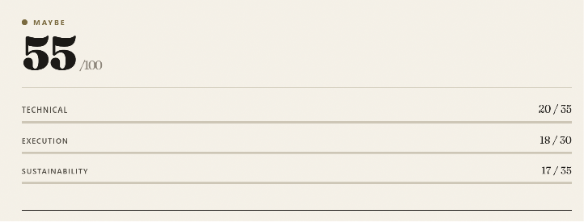
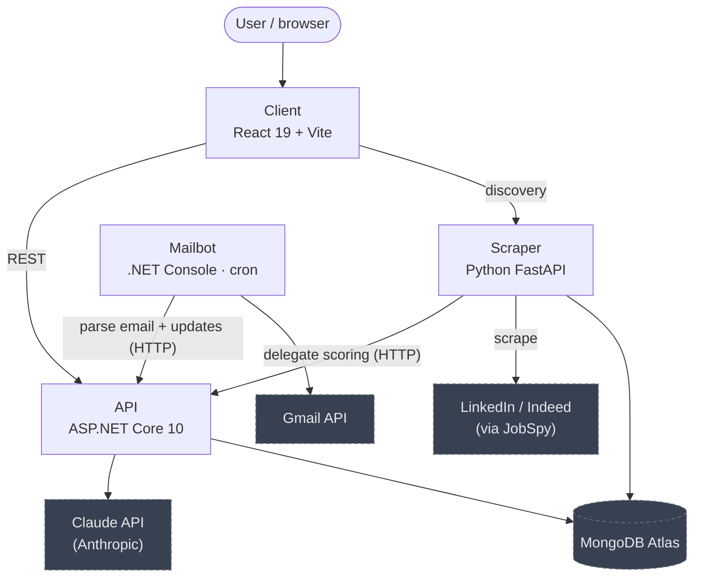
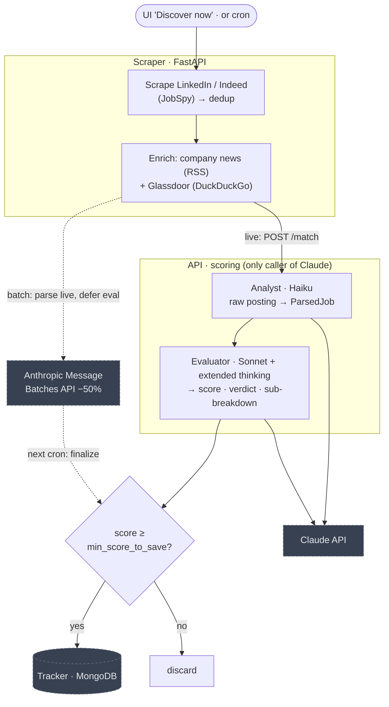
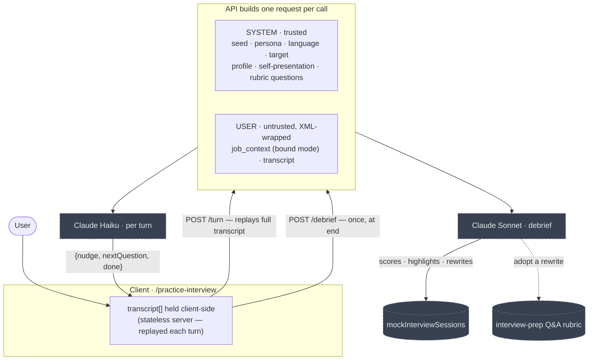
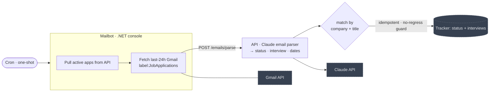

# NextRole

**An AI-powered, end-to-end job-search platform** — it discovers job listings, scores each one against your professional profile with Claude, monitors your inbox for application updates, and tracks every role from discovery through interviews to final outcome. Built as a four-service monorepo (C#, Python, React) and deployed to production on Render.

> Single-tenant by design: one user, no authentication (intentional — it's meant to run as your private tool against your own database).

---

## Table of Contents

- [Highlights](#highlights)
- [Screenshots](#screenshots)
- [Architecture](#architecture)
- [Features](#features)
- [System design](#system-design)
- [The AI scoring pipeline](#the-ai-scoring-pipeline)
- [Tech stack](#tech-stack)
- [Getting started](#getting-started)
- [Environment variables](#environment-variables)
- [Project structure](#project-structure)
- [Testing](#testing)
- [Deployment & CI/CD](#deployment--cicd)

---

## Highlights

If you're skimming for the engineering, two things are worth a closer look:

- **A two-model scoring pipeline** with a cost-aware async batch mode — see [The AI scoring pipeline](#the-ai-scoring-pipeline).
- **Prompt-injection defense** — untrusted external data (job descriptions, scraped news, raw emails) is always XML-wrapped and kept out of the system prompt.

---

## Screenshots

A custom **Editorial Broadsheet** theme — warm paper, hairline rules, a Fraunces display serif. The chrome is English LTR; AI-generated content (Hebrew analyses, interview text) renders right-to-left.

| Landing | Job discovery |
|:---:|:---:|
|  |  |

| AI job scoring | Application tracker |
|:---:|:---:|
|  |  |

Every scored job breaks down across the three weighted dimensions:



---

## Architecture

Four loosely-coupled services communicate over HTTP, fronted by a single-page React app behind an Nginx reverse proxy. **All Claude/Anthropic calls live exclusively in the API** — the scraper and mailbot delegate AI work to it over HTTP, keeping the API key and prompt logic in one place.

The diagram shows how the services connect; the table below carries the detail.



### Services

| Service | Stack | Port (dev / Docker) | Purpose |
|---------|-------|---------------------|---------|
| **API** | ASP.NET Core 10 (Minimal APIs) | `5002` | Unified backend and **the only service that calls Claude**: AI job scoring, application/interview/note/status tracking, profile, interview prep, mock interview, email parsing |
| **Scraper** | Python FastAPI | `8000` / `5137` | Scrape LinkedIn/Indeed via JobSpy, enrich with company news + Glassdoor, delegate scoring to the API, auto-save matches |
| **Mailbot** | .NET 10 Console | — | One-shot (cron): fetch Gmail, parse with Claude (via API), push status/interview updates. Not a long-running service |
| **Client** | React 19 + Vite 6 | `5173` / `3000` | English LTR SPA with the custom *Editorial Broadsheet* theme; Nginx reverse proxy in production |

---

## Features

- **AI job matching** — Paste any job description and get a detailed compatibility score with strengths, concerns, a sub-component breakdown, and an honest verdict — powered by Claude. (`/score`)
- **Automated job discovery** — Define search criteria (titles, locations, values, preferences) and let the system scrape LinkedIn/Indeed, enrich each result, score it with AI, and auto-save qualifying matches above a configurable threshold. Live or scheduled batch runs.
- **Company enrichment** — Auto-fetched Google News headlines and Glassdoor ratings feed the evaluator; on-demand AI company summaries and a personalized "why work here?" answer on each application.
- **Application tracking** — Full lifecycle: applications, interviews, notes, status updates, an upcoming-interview column, and a statistics dashboard.
- **Interview prep** — Author self-presentations and a Q&A rubric; toggle prose into AI-distilled keyword cues for rehearsal from memory.
- **Mock interview** — Interactive, turn-by-turn AI interview practice with an HR or technical persona, live follow-ups, and a scored debrief whose rewrites can be adopted back into your prep rubric.
- **Email sync (mailbot)** — Detects interview invites, rejections, and offers from Gmail and updates the tracker automatically — idempotently.
- **Résumé upload** — Drop in a PDF or TXT résumé to auto-normalize your profile (PDFs are handed to Claude natively, no extraction library).

---

## System design

The flow of the app's core engines. The top-level [Architecture](#architecture) shows *which* services exist; these show *how* each feature moves data through them. Every Claude call lives in the API; dashed nodes are external systems.

### Job discovery & AI scoring

Scrape → enrich → score → auto-save. The **live** path scores synchronously; the **batch** path defers the expensive evaluator call to Anthropic's Message Batches API (50% cheaper) and finalizes on the next cron run.



### Mock interview (stateless turn engine)

The client holds the whole transcript and **replays it every turn** — the server keeps no session state. Trusted context (profile, prep) goes in the system prompt; untrusted data (job context, the transcript) is XML-wrapped in the user message. Cheap Haiku per turn, Sonnet once for the debrief.



### Email sync (Mailbot)

A one-shot cron process: pull active applications, parse the last 24 h of Gmail with Claude, and apply status/interview updates — matched by company + title, idempotent, and never moving an application backwards.



---

## The AI scoring pipeline

Each job scoring is **two Claude API calls**, both with generic, candidate-agnostic prompts — all candidate-specific signal comes from the injected professional profile:

1. **Analyst (Claude Haiku)** — a generic job-description parser: raw posting → structured `ParsedJob` JSON.
2. **Evaluator (Claude Sonnet, extended thinking)** — scores fit and returns a structured verdict.

**Scoring dimensions** (each split into scored sub-components with one-sentence reasons):

| Dimension | Weight | Sub-components |
|-----------|--------|----------------|
| Technical Fit | 35 | Core Stack (0–20) + System Design (0–15) |
| Engineering Execution Fit | 30 | Practices / Role Clarity + Engineering Maturity |
| Sustainability & Pace Fit | 35 | Work-Life + Communication/Pace + Growth/Risk |

**Verdicts:** `STRONG_YES` · `YES` · `MAYBE` · `NO` · `STRONG_NO` · `INSUFFICIENT_DATA`. A job auto-saves to the tracker iff its score clears a single configurable threshold (`min_score_to_save`).

**Engineering details worth noting:**

- **The profile is the only user-editable input;** prompts and scoring config are read-only server configuration (the .NET Options pattern, overridable per-deploy via env vars — no runtime editing). Experience and skills are LLM-normalized from pasted free text or an uploaded résumé; strengths and core values stay manual.
- **`live` vs `batch` modes.** The live path scores synchronously. The batch path runs the analyst live but submits evaluator calls to the **Message Batches API** and finalizes on the next cron firing — driven by a single collect-then-submit cron, with a dedicated `pending → scraping → parsing → awaiting_batch → finalizing → completed` status machine and an orphan-reconciler that survives restarts.
- **Resilience.** The evaluator response is streamed (keeps the connection alive on long generations) with prompt caching on the static system prompt; the JSON layer has lenient deserializers, fence/brace extraction, comment stripping, and an auto-retry "return ONLY JSON" nudge.
- **Parallelism.** Up to 5 jobs scored concurrently via an `asyncio.Semaphore`.
- **Cooperative cancellation.** Aborting a run lands a terminal `cancelled` status; every orchestrator status write is guarded so the in-flight task can't resurrect a cancelled run.

---

## Tech stack

**Backend (.NET)**
- ASP.NET Core 10 — Minimal APIs
- Anthropic SDK for .NET (Claude integration: streaming, extended thinking, prompt caching, Message Batches, native PDF documents)
- MongoDB Driver v3
- Google Gmail API (mailbot)

**Backend (Python)**
- FastAPI + Uvicorn
- `python-jobspy` (LinkedIn/Indeed scraping)
- Motor (async MongoDB driver)
- pydantic-settings

**Frontend**
- React 19 + React Router v7
- Vite 6 · TypeScript · **Bun** (runtime & package manager)
- shadcn/ui + Tailwind CSS v4 — custom *Editorial Broadsheet* theme
- TanStack React Query (server state) · Axios (HTTP)
- Vitest + Testing Library (unit/component)

**Infrastructure**
- MongoDB Atlas (`job-tracker` + `jobmatch` databases)
- Docker + Docker Compose
- GitHub Actions CI/CD · GitHub Container Registry (`ghcr.io`)
- Render (hosting) · Nginx (production proxy)
- Playwright (E2E)

---

## Getting started

### Prerequisites

- [.NET 10 SDK](https://dotnet.microsoft.com/download) — API, Mailbot, Seeder
- [Python 3.12+](https://www.python.org/) — Scraper
- [Bun](https://bun.sh/) — frontend runtime & package manager
- A [MongoDB](https://www.mongodb.com/) instance (Atlas free tier works)
- An [Anthropic API key](https://console.anthropic.com/)
- [Docker](https://www.docker.com/) (optional — for the all-in-one path)
- A Google Cloud OAuth client (optional — only for the mailbot/Gmail sync)

### Option A — Docker Compose (all services)

```bash
export ANTHROPIC_API_KEY=your-key-here
export MONGODB_CONNECTION_STRING=mongodb://your-connection-string

docker compose up --build
```

Open [http://localhost:3000](http://localhost:3000).

Ports: client `:3000`, API `:5002`, scraper `:5137`.

### Option B — Run the core locally (minimum setup)

The app runs on just a MongoDB connection string + an Anthropic key. The scraper and mailbot are optional.

```bash
# API — match + tracking (http://localhost:5002)
MongoDB__ConnectionString="<your-mongo-uri>" Anthropic__ApiKey="sk-ant-..." \
  dotnet run --project server/api/src/Api

# Client (http://localhost:5173)
cd client && bun install && bun run dev
```

### Optional services

```powershell
# Scraper — Python FastAPI on :8000 (PowerShell for venv activation)
cd server/scraper
python -m venv .venv
.\.venv\Scripts\python.exe -m pip install -r requirements.txt
.\.venv\Scripts\python.exe -m uvicorn app.main:app --host 0.0.0.0 --port 8000 --reload
```

```bash
# Mailbot — one-shot Gmail sync (skips cleanly if no Gmail credentials)
dotnet run --project server/mailbot

# Build the whole .NET solution
dotnet build nextrole.sln
```

---

## Environment variables

The Mongo connection string and the Anthropic key are read **only** from the environment — never hardcoded. `.env.example` templates are provided for the [API](server/api/src/Api/.env.example), [Scraper](server/scraper/.env.example), and [Mailbot](server/mailbot/.env.example); copy to `.env` and fill in. ASP.NET maps `__` in env-var names to config `:` (e.g. `MongoDB__ConnectionString` → `MongoDB:ConnectionString`).

> **Minimum to run:** the API needs only `MongoDB__ConnectionString` + `Anthropic__ApiKey`; the Scraper needs only `MONGODB_CONNECTION_STRING`. Everything else is optional with sensible defaults.

### API (ASP.NET Core)

| Variable | Required | Default | Description |
|----------|----------|---------|-------------|
| `MongoDB__ConnectionString` | **yes** | — | MongoDB connection string |
| `Anthropic__ApiKey` | **yes** | — | Claude API key |
| `MongoDB__DatabaseName` | no | `job-tracker` | Application-tracking DB |
| `MongoDB__ProfileDatabase` | no | `jobmatch` | Profile/scoring DB |
| `CorsOrigins` | no | `""` (none) | Comma-separated allowed browser origins; `*` for dev |
| `Scoring__*`, `Prompts__Analyzer`, `Prompts__Evaluator` | no | see `appsettings.json` / `PromptSeeds.cs` | Read-only scoring config & prompt overrides |

### Scraper (Python FastAPI)

| Variable | Required | Default | Description |
|----------|----------|---------|-------------|
| `MONGODB_CONNECTION_STRING` | **yes** | — | MongoDB connection string |
| `MONGODB_DATABASE_NAME` | no | `job-tracker` | Database name |
| `API_BASE_URL` | no | `http://localhost:5002` | Unified API URL (scoring, dedup, save) |
| `CRON_SECRET` | no | `""` (no guard) | Shared secret for cron-triggered endpoints |
| `CORS_ORIGINS` | no | `*` | Comma-separated allowed browser origins |

### Mailbot (.NET console, optional) & Frontend

The mailbot reads config from env vars or a local `.env`. It does **not** need an Anthropic key — email parsing happens in the API.

| Variable | Service | Required | Description |
|----------|---------|----------|-------------|
| `Tracker__BaseUrl` | Mailbot | no (`http://localhost:5002`) | API URL the mailbot posts updates to |
| `Gmail__CredentialsPath` | Mailbot | no | OAuth client-secrets JSON; **if absent, mailbot skips and exits cleanly** |
| `Gmail__Query` | Mailbot | no (`label:JobApplications newer_than:1d`) | Gmail search for the daily sync |
| `Mailbot__Resync` | Mailbot | no (`false`) | `true` → next run re-syncs from full history instead of the daily 24h sync |
| `Mailbot__ResyncCompany` / `Mailbot__ResyncTitle` | Mailbot | no | Scope re-sync to one company/role; if unset, re-sync all |
| `API_URL` / `SCRAPER_URL` | Frontend (Nginx) | no | Upstream URLs for the reverse proxy |
| `VITE_API_URL` / `VITE_SCRAPER_URL` | Frontend (build arg) | no | Direct-call URLs baked into the SPA (bypass nginx) |

---

## Project structure

```
nextrole/
├── client/              # React 19 + Vite SPA
├── server/
│   ├── api/             # ASP.NET Core 10 — AI scoring + tracking
│   ├── scraper/         # Python FastAPI — job scraping + enrichment
│   └── mailbot/         # .NET console — Gmail sync
├── e2e/                 # Playwright end-to-end tests
├── docker-compose.yml   # run the whole stack
└── .github/workflows/   # per-service CI/CD
```

---

## Testing

**Unit / component (frontend)** — Vitest + Testing Library:

```bash
cd client && bunx vitest run
```

**End-to-end** — Playwright (in `/e2e`):

```bash
cd e2e && npx playwright test --reporter=line
```

> ⚠️ **Stop your dev servers first.** Playwright's `webServer` config reuses existing servers when not in CI, so a running dev stack on `:5002/:8000/:5173` makes the suite run against your dev databases instead of the disposable test DBs (`job-tracker-test` / `jobmatch-test`).

---

## Deployment & CI/CD

Each service has its own GitHub Actions workflow with **path-based triggers** — a push to `main` touching a service's directory builds and deploys only that service:

| Workflow | Trigger path | Builds | Deploys |
|----------|-------------|--------|---------|
| `api.yml` | `server/api/**` | Docker image → `ghcr.io` | Render webhook |
| `scraper.yml` | `server/scraper/**` | Docker image → `ghcr.io` | Render webhook |
| `mailbot.yml` | `server/mailbot/**` | Docker image → `ghcr.io` | Render webhook |
| `frontend.yml` | `client/**` | Docker image → `ghcr.io` | Render webhook |

Each pipeline logs into GHCR, builds the service's Dockerfile, tags `:latest`, and triggers a Render deploy.

---

<sub>Built by Ozz Shpigel. NextRole is a personal project — see [`project-scope.md`](project-scope.md) and [`implementation-plan.md`](implementation-plan.md) for the original brief.</sub>
